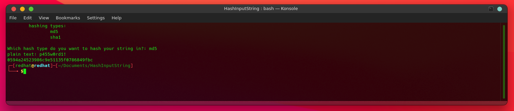

# HashInputString
Simple python script for hashing sha1 and md5 
Using the hashlib moduel, hash the plaintext input.


Clone
```bash
git clone https://github.com/CollinEdward/HashInputString.git
```


